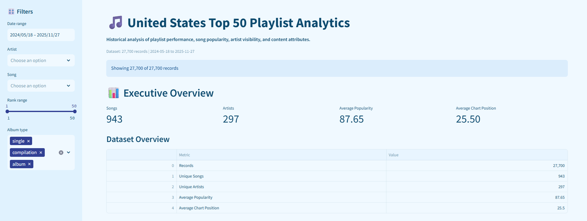
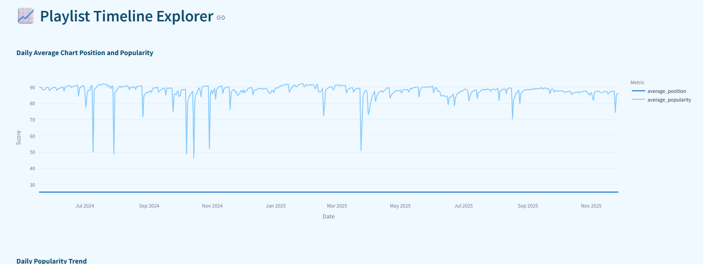
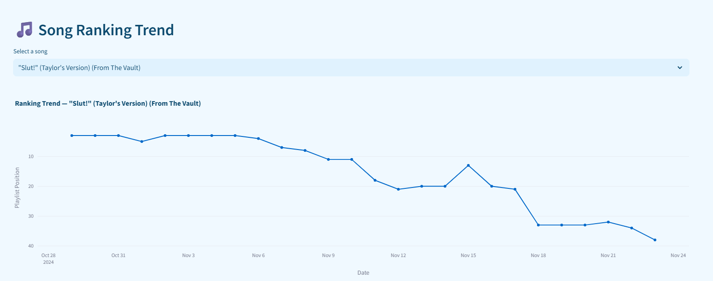
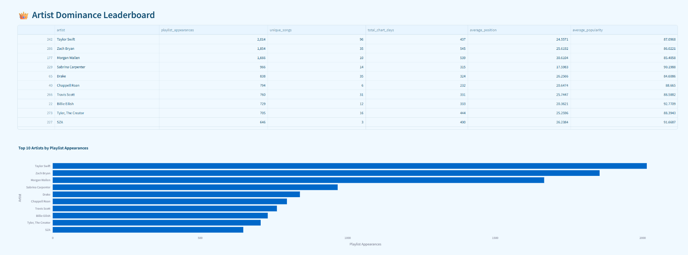
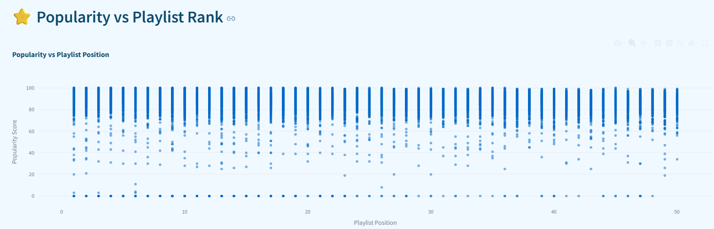

# 🎵 United States Top 50 Playlist Analytics

### Historical Playlist Performance, Song Popularity, Artist Visibility & Content Analysis

**Author:** Saloni Awari

**Live Dashboard:** https://us-top50-playlist-analytics2026.streamlit.app/

---

##  Project Overview

This project analyzes historical **United States Top 50 playlist data** to understand how songs, artists, rankings, popularity, and content attributes behave over time.

The project focuses on **historical analytics rather than prediction or recommendation**.

The goal is to transform daily playlist observations into an interactive analytics product that helps users explore:

* Playlist ranking behaviour
* Song popularity
* Song longevity and chart presence
* Artist visibility and repeat appearances
* Popularity versus playlist position
* Explicit versus non-explicit performance
* Release format performance
* Song duration
* Album size and song performance

---

## Objectives

The analysis investigates:

1. How playlist rankings change over time.
2. Which songs maintain strong playlist presence.
3. How artist visibility changes through repeated playlist appearances.
4. The relationship between popularity and playlist position.
5. Differences between explicit and non-explicit tracks.
6. Differences across release formats.
7. Whether song duration is associated with popularity and rank.
8. Whether album size shows a relationship with song performance.

---

##  Dataset

The final validated dataset contains:

| Metric                |                              Value |
| --------------------- | ---------------------------------: |
| Playlist observations |                         **27,700** |
| Daily snapshots       |                            **554** |
| Unique songs          |                            **943** |
| Unique artists        |                            **297** |
| Date range            |      **19 Sep 2026 – 28 Sep 2026** |
| Playlist positions    |                           **1–50** |

### Main fields

* `date`
* `position`
* `song`
* `artist`
* `popularity`
* `duration_ms`
* `album_type`
* `total_tracks`
* `is_explicit`
* `album_cover_url`

---

## 🔬 Analytical Methodology

### 1. Data Ingestion & Validation

The dataset was loaded and validated for:

* Playlist rank range
* Missing values
* Duplicate song-date observations
* Date consistency
* Artist and song fields

### 2. Feature Engineering

Derived analytical metrics include:

* Days on Chart
* Average Rank
* Best Rank Achieved
* Rank Volatility
* Popularity Trend
* Duration in Minutes

### 3. Exploratory Data Analysis

The project analyzes:

* Daily rank distribution
* Rank movement
* Song longevity
* Artist visibility
* Popularity distribution
* Popularity versus rank
* Explicit content
* Release format
* Song duration
* Album size

---

## 🖥️ Interactive Streamlit Dashboard

The project includes an interactive Streamlit application.
### 📸 Dashboard Preview

#### Executive Overview


#### Playlist Timeline Explorer


#### Song Ranking Trend


#### Artist Dominance


#### Popularity & Content Analysis


### Dashboard modules

**Executive Overview**

* Dataset scale
* Key KPIs
* Overall playlist statistics

**Playlist Timeline Explorer**

* Historical playlist behaviour
* Position and popularity trends

**Song Ranking Trend**

* Individual song ranking movement over time

**Artist Dominance**

* Artist appearances
* Unique songs
* Chart days
* Average position
* Average popularity

**Popularity vs Playlist Rank**

* Scatter analysis
* Rank-popularity relationship

**Explicit vs Non-Explicit Performance**

* Track observations
* Unique songs
* Average position
* Average popularity

**Release Format Performance**

* Album
* Compilation
* Single

**Song Duration Analysis**

* Duration across ranking groups
* Duration versus popularity

**Album Size vs Song Success**

* Album track count
* Popularity
* Playlist position

---

## 📈 Key Analytical Result

The observed Spearman rank correlation between playlist position and popularity is approximately:

**ρ = -0.245**

This indicates a modest inverse association in the analyzed dataset.

The result is treated as an **observational relationship**, not evidence of causation.

---

## 🛠️ Technology Stack

* **Python**
* **Pandas**
* **NumPy**
* **SciPy**
* **Plotly**
* **Jupyter Notebook**
* **Streamlit**
* **GitHub**

---

## 📁 Project Structure

```text
us-top50-playlist-analytics/
│
├── streamlit_app.py
├── requirements.txt
├── README.md
│
├── data/
│   └── processed/
│       └── us_top50_clean.csv
│
├── notebooks/
│   ├── 01_data_ingestion.ipynb
│   ├── 02_data_cleaning.ipynb
│   ├── 03_feature_engineering.ipynb
│   └── 04_eda.ipynb
│
├── research/
│   └── US_Top50_Playlist_Market_Research_Paper.pdf
│
└── assets/
    └── dashboard_screenshots/
```

---

## 🚀 Live Project

### 🌐 Streamlit Dashboard

**[Open the Live Dashboard](https://us-top50-playlist-analytics2026.streamlit.app/)**

The deployed application provides interactive filters and visual analytics for exploring the historical playlist dataset.

---

## 📄 Research Paper

**Research paper:**
`United States Top 50 Playlist Market Performance, Artist Visibility & Content Analysis`

The research paper documents the project's:

* Research objectives
* Dataset and data quality
* Analytical methodology
* Exploratory analysis
* Key findings
* Strategic recommendations
* Limitations
* Reproducibility approach

**Research paper PDF:** `research/US_Top50_Playlist_Performance_Research_Paper.pdf`

---

## 💡 Why This Project Matters

Playlist rankings are dynamic. A single peak position does not fully describe a song's performance.

This project therefore combines:

**Ranking + Popularity + Longevity + Artist Visibility + Content Attributes**

to provide a broader historical view of playlist performance.

The dashboard is designed to help users move from individual chart observations toward structured, data-driven analysis.

---

## 🔎 Project Scope

This project is intentionally focused on **descriptive and historical analytics**.

It does not claim to:

* Predict future chart performance
* Recommend songs
* Establish causal relationships
* Represent the complete music market

The findings should therefore be interpreted within the scope of the analyzed United States Top 50 playlist dataset.

---

## 👩‍💻 Author

### Saloni Awari

Data Analytics | Python | Exploratory Data Analysis | Streamlit

---

## ⭐ Project Links

| Resource               | Link                                                   |
| ---------------------- | ------------------------------------------------------ |
| 🚀 Live Dashboard      | https://us-top50-playlist-analytics2026.streamlit.app/ |
| 💻 GitHub Repository   | This repository                                        |
| 📄 Research Paper     |`research/US_Top50_Playlist_Performance_Research_Paper.pdf`|
| 🎥 Project Walkthrough | Coming soon                                            |

---

## 📜 License

This project is intended for educational, portfolio, and analytical demonstration purposes.
